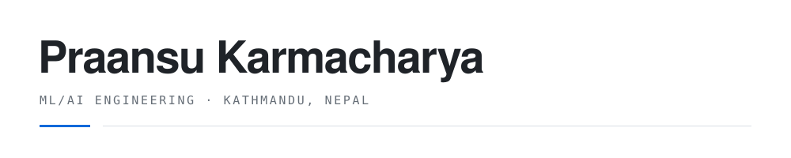

<picture>
  <source media="(prefers-color-scheme: dark)" srcset="header-dark.svg">
  
</picture>

<div align="center">

# Praansu Karmacharya

**Junior AI Developer · CS undergrad · Kathmandu, Nepal**

[](mailto:Praansu12@gmail.com)
[](https://praansu.github.io)
[](https://www.linkedin.com/in/praansu-karmacharya-694944368/)
[](https://github.com/Praansu)
[](mailto:Praansu12@gmail.com)

</div>

```yaml
now:
  studying: "BSc Computing, Islington College Kathmandu"
  building: "reliability study on small tool-calling agents"
  shipping: "RAG pipelines and agent loops for freelance clients"
  open_to: ["junior AI/ML roles", "freelance RAG + agent work"]
  based_in: "Kathmandu, Nepal (UTC+5:45)"
```

ML/AI engineer in Kathmandu. I build retrieval systems, agent loops and vision models, then write down what broke and why.

Previously a Junior AI Developer at Aviyaan Tech — six months of production AI work. I like work I can point at and say: that runs because of me.

---

## Experience

**Junior AI Developer** — Aviyaan Tech · *6 months experience*
Built and tested AI features for production web projects, working with Python ML tooling and LLM APIs alongside senior developers. First time seeing how AI code survives contact with real clients.

**Freelance AI/ML Engineer** — Self-employed · *2024 — present*
RAG pipelines, custom agent loops, ML model deployment, and full-stack AI products for clients. Most of the work below comes from here.

**BSc Computing student** — Islington College, Kathmandu · *2023 — present*
Bachelor of Computer Science. Focus on ML, AI, and full-stack development.

---

## Selected work

| Project | What it does | Stack | Type |
|---|---|---|---|
| **[ai-research-agent](https://github.com/Praansu/ai-research-agent)** — Ask questions over your PDFs, Markdown or text files. The agent routes between document search, web search, or both, and streams every tool call to the browser live instead of hiding the loop behind a framework. The whole loop is ~120 lines of plain Python. | `Python` `FastAPI` `ChromaDB` `SSE` |  |
| **[small-agent-reliability](https://github.com/Praansu/small-agent-reliability)** — Nine open-weight models (1B–9B) scored as tool-using agents across 31 capability and 14 reliability tasks. Accuracy, consistency, robustness, failure recovery and refusal behaviour scored separately, not collapsed into one leaderboard. Reproduces on a laptop via Ollama. | `Python` `Ollama` `pandas` `LaTeX` |  |
| **[pdf-chat-rag](https://github.com/Praansu/pdf-chat-rag)** — Document Q&A with real CRUD: deleting a document removes its vectors, file and database row in one operation — the part most demos skip. Answers stream token by token over SSE. | `Python` `FastAPI` `ChromaDB` `PyMuPDF` |  |
| **[vehicle-image-classifier](https://github.com/Praansu/vehicle-image-classifier)** — ResNet-18 transfer learning on 400 images across four classes. Reports a confusion matrix and per-class accuracy next to the headline number, because one aggregate hides a model that's good at one class and guessing at another. Served behind FastAPI, containerised. | `PyTorch` `ResNet-18` `FastAPI` `Docker` |  |
| **[nnunet-road-cracks](https://github.com/Praansu/nnunet-road-cracks)** — nnU-Net pipeline for road crack and pavement distress segmentation, packaged so a survey engineer can run it without a Python environment or a command line. | `nnU-Net` `PyTorch` `packaging` |  |
| **[EcoVerda](https://github.com/Praansu/eco-verda)** — Full-stack storefront for sustainable products: cart persistence, credentials auth, orders and reviews on Next.js 16 + Prisma/SQLite. The Stripe client exists but isn't wired into checkout yet — tracked as a known issue in the repo. [Live demo](https://praansu.github.io/eco-verda/) | `Next.js` `TypeScript` `Prisma` `Stripe` |  |
| **[ParkX](https://github.com/Praansu/ParkX)** — Smart parking across three layers: ESP32 sensor firmware, a FastAPI backend, and a dashboard polling bay state every 2 seconds. Bookings, anomaly alerts, and a local-Ollama-first, Groq-fallback chatbot. | `ESP32` `FastAPI` `Ollama` |  |

<details>
<summary><b>More repos — experiments, coursework, and old tools (9)</b></summary>
<br>

- **[demand-predictor-ml](https://github.com/Praansu/demand-predictor-ml)** — parking demand forecasting experiments with XGBoost and scikit-learn.
- **[health-guard-ml](https://github.com/Praansu/health-guard-ml)** — early-stage health-risk classifier; still a stub with honest TODOs in the README.
- **[career-stability](https://github.com/Praansu/career-stability)** — data exploration on job-stability survey data.
- **[ai-doc-summarizer](https://github.com/Praansu/ai-doc-summarizer)** — abstractive summarization API experiment *(archived)*.
- **[qgis-batch-extraction](https://github.com/Praansu/qgis-batch-extraction)** — QGIS batch-processing scripts for geospatial layers *(archived)*.
- **[vehicle-labeling-tool](https://github.com/Praansu/vehicle-labeling-tool)** — tiny Tkinter app built to label the vehicle classifier's training set *(archived)*.
- **[todo-list-cli](https://github.com/Praansu/todo-list-cli)** — my first Python CLI project *(archived)*.
- **[js-calculator](https://github.com/Praansu/js-calculator)** — weekend JavaScript calculator.
- **[MyProjects](https://github.com/Praansu/MyProjects)** — old scratch repo of first experiments *(archived)*.

</details>

---

## What I work with

<picture>
  <source media="(prefers-color-scheme: dark)" srcset="https://skillicons.dev/icons?i=py,pytorch,fastapi,ts,nextjs,react,tailwind,postgres,prisma,docker,linux,git&theme=dark">
  
</picture>

**Comfortable**
Python, FastAPI, RAG pipelines, ChromaDB, prompt and tool design, PyTorch, scikit-learn, pandas, Docker, Git and GitHub Actions, SQLite, REST APIs

**Used on real projects**
Next.js, TypeScript, React, Tailwind, PostgreSQL, Prisma, Stripe, XGBoost, OpenCV, ESP32, REST polling, Linux and shell

**Studying now**
CUDA and GPU profiling, GGUF quantisation, MLOps and experiment tracking, distributed training

---

## Activity

| Stats | Streak |
|---|---|
| <picture><source media="(prefers-color-scheme: dark)" srcset="https://github-readme-stats.vercel.app/api?username=Praansu&show_icons=true&theme=github_dark&hide_border=true&bg_color=00000000"></picture> | <picture><source media="(prefers-color-scheme: dark)" srcset="https://streak-stats.demolab.com?user=Praansu&theme=github-dark-blue&hide_border=true&background=00000000"></picture> |

<picture>
  <source media="(prefers-color-scheme: dark)" srcset="https://github-readme-stats.vercel.app/api/top-langs/?username=Praansu&layout=compact&theme=github_dark&hide_border=true&bg_color=00000000">
  
</picture>

---

<div align="center">

**Open to ML/AI engineering roles — remote or in Kathmandu.**

[](https://praansu.github.io)
[](https://www.linkedin.com/in/praansu-karmacharya-694944368/)
[](mailto:Praansu12@gmail.com)


</div>
